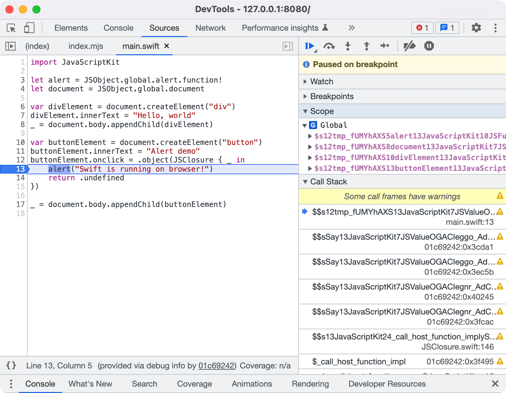

# Debugging

Debugging is one of the most important parts of application development. This section describes debugging tools compatible with SwiftWasm.

These tools are DWARF-based, so you need to build your application with DWARF sections enabled.
If you are using `carton bundle`, you can use the `--debug-info` flag to enable debugging with optimized application.
If you are using `swift build`, it is enabled by default.

## Chrome DevTools

When you are debugging a web browser application, Chrome DevTools is a good tool to use. It allows you to
put breakpoints, step through at Swift source code level.

Please follow the steps below to configure Chrome DevTools for SwiftWasm:

1. Install [`C/C++ DevTools Support (DWARF)`](https://goo.gle/wasm-debugging-extension) extension in your Chrome
2. Enable `WebAssembly Debugging: Enable DWARF support` in `Experiments` pane of DevTools settings

See [the DevTools team's official introduction](https://developer.chrome.com/blog/wasm-debugging-2020) for more details about the extension.

Note that the function names in the stack trace are mangled. You can demangle them using `swift demangle` command.

Unfortunately, variable inspection is unavailable since Swift depends on its own mechanisms to do that instead of DWARF's structure type feature. (See [this thread](https://github.com/swiftwasm/swift/issues/593) for more details)

## [wasminspect](https://github.com/kateinoigakukun/wasminspect)

[wasminspect](https://github.com/kateinoigakukun/wasminspect)
can help in the investigation if the debugged binary does not rely on integration with JavaScript.
We recommend splitting your packages into separate executable targets, most of which shouldn't 
assume the availability of JavaScript to make debugging easier.

